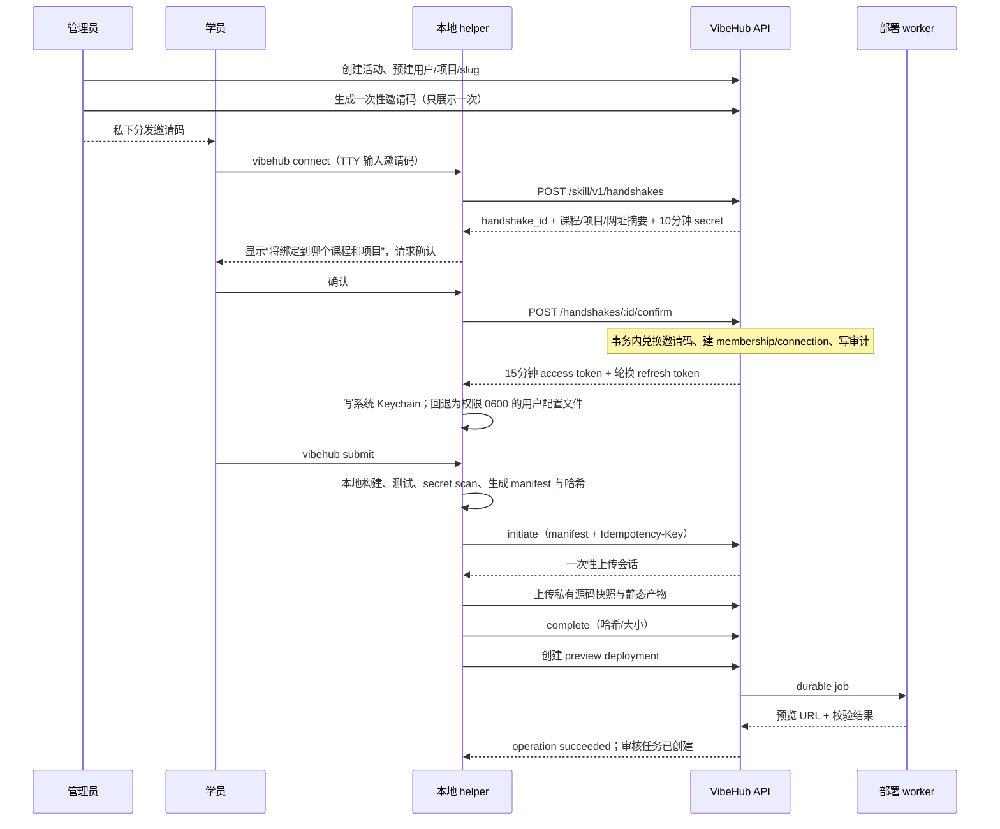
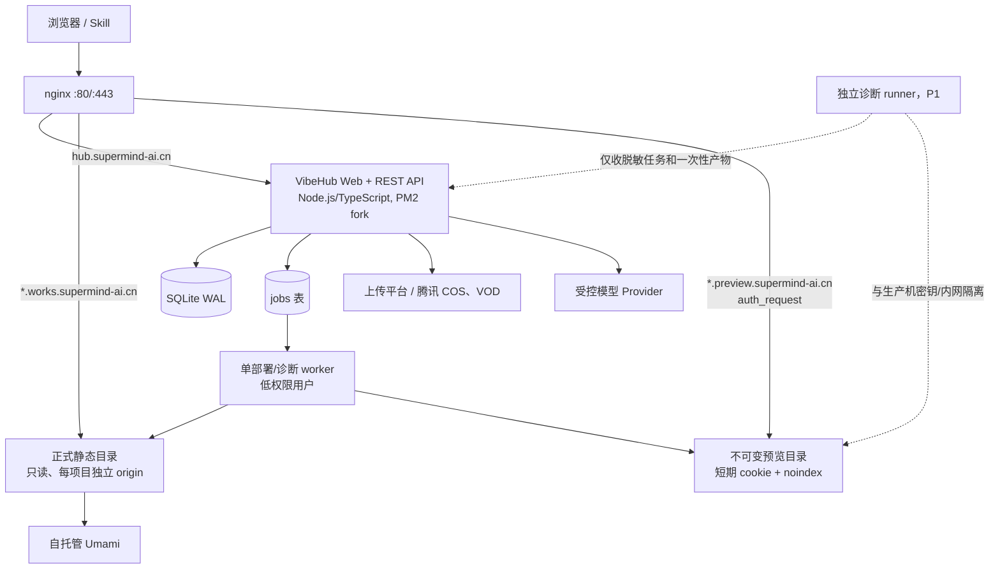

# VibeHub 架构方案（Codex 独立起草）

> 状态：架构提案  
> 日期：2026-07-24  
> 适用规模：单机、1 名主力工程师 + 1 名顾问、100～300 个作品  
> 核心结论：采用 **Node.js/TypeScript 模块化单体 + SQLite WAL + nginx**；学员作品采用 **静态站 + 平台托管 BaaS**，P0 只开放静态作品，不允许学员在生产机运行任意后端；作品和预览分别使用独立泛子域名；邀请码只用于首次绑定，后续使用短期访问凭证和可轮换刷新凭证；老师审核是正式发布的唯一闸门。

### 事实、假设与待验证边界

#### 已核实事实

- 生产机为腾讯云南京 Lighthouse `<南京机 IP，见 server-vault TC_NANJING_*>`，Ubuntu 24.04，2 vCPU、7.4 GB RAM、79 GB 磁盘，当前几乎空载。
- nginx 已监听 80 与 8080，certbot 已安装，443 尚未监听。
- `supermind-ai.cn` 已解析到该机，80 端口返回 200；现有信息足以确认主域名已备案。子域名接入和 HTTPS 仍需实际验收。
- 现有静态部署使用 `/var/www/sites/<name>/` 与 `http://<南京机 IP，见 server-vault TC_NANJING_*>:8080/<name>/`；后端使用 `backdeploy`、PM2 和自助反代。
- 用户包含零基础学员和未成年人；作品公开前必须经老师审核。
- 已有自托管 Umami：`statistics.superbrain-ai.com`。
- 产品要求版本、预览、审核、正式发布分离；新版本驳回时旧正式版本继续可访问；AI 诊断必须绑定明确版本和时间，百分比必须能由下方诊断项解释。

#### 本方案采用但需验证的容量假设

- 一个静态发布产物解压后默认不超过 20 MiB；P0 的普通网页图片可随站点包，音视频和大文件暂不托管。P1 上线文件服务后，这些大媒体才走独立 Provider，不进入站点包。
- 每个项目在生产机最多保留 3 份可运行产物：当前正式版、上一正式版、当前待审版。其余版本保留元数据和私有对象存储快照。
- P0 每个项目只允许一个 pending review；新版本成功生成预览后，旧 pending 自动标记 superseded，旧预览经过 24 小时排障宽限期后清理。已批准的正式版本不受此规则影响。
- 300 个项目的站点产物上限约为 `300 × 3 × 20 MiB = 18 GiB`；再给临时解包和回滚留 30% 余量约为 24 GiB，能放入 79 GB 磁盘，但必须配置配额、清理任务和磁盘告警。
- 运行时 BaaS 是共享服务，不为每个项目创建独立进程；部署和诊断任务串行或低并发执行。

#### 开工前必须验证

1. 腾讯云安全组、主机防火墙和运营商链路能否开放 443。
2. DNS 服务是否支持 API 自动维护 DNS-01 TXT 记录；API 凭证能否限制到 `_acme-challenge` 所需范围。
3. `*.works.supermind-ai.cn`、`*.preview.supermind-ai.cn` 的 DNS、证书和境内访问是否正常；“主域名已备案”不自动等于所有接入细节已验收。
4. 当前 Umami 版本、API 鉴权方式、跨域统计脚本和按作品创建 website 的自动化能力。
5. 上传平台当前腾讯云 VOD/COS 生产链路，因为其测试计划明确把真实云上传排除在离线测试之外。
6. 首期课程是否强依赖“作品运行时上传、共享数据或 AI 调用”。这决定 BaaS 是 P0 阻塞项还是 P1。
7. 未成年人作品的公开署名规则、内容审核清单、投诉与下架负责人。

---

## 1. 学员作品的承载形态

### 明确推荐

推荐把产品方向定为 **静态站 + 平台托管 BaaS**，分两步交付：

1. **P0 只发布静态站**：构建在学员本机由 Skill 完成，平台接收构建产物，不在生产机执行 `npm install`、构建脚本、`postinstall` 或学员后端。
2. **P1 增加受限 BaaS**：学员仍不写和不部署后端，只调用平台统一提供的项目级数据、文件和 AI 接口。BaaS 提供声明式能力，不提供任意 SQL、任意函数或任意服务器代码。

这不是在“纯静态”和“BaaS”之间折中，而是用纯静态作为安全的首发能力，用共享 BaaS 扩大作品表达能力。两者共享同一套邀请码、项目、版本、审核、域名和配额模型。

### 三条路线对比

| 路线 | 100～300 个作品在当前机器上的判断 | 学员体验 | 主要收益 | 主要代价 |
|---|---|---|---|---|
| 纯静态站 | **可行，P0 推荐**。nginx 只读文件，作品没有常驻进程；主要约束是磁盘和发布队列 | 最简单，但上传、共享数据、登录、AI 等功能受限 | 安全边界清晰、资源占用低、发布可原子切换 | 无法独立支撑动态产品 |
| 静态 + 平台托管 BaaS | **可行，作为目标形态推荐**。100～300 个项目共享一个 API、数据库和限流器，不按项目创建进程 | 学员只调用固定 SDK/API，不碰服务器与密钥 | 能覆盖表单、作品数据、文件和 AI，同时保持统一治理 | 平台要承担多租户鉴权、配额、滥用防护和数据迁移 |
| 任意后端进程 | **当前机器不宜采用**。常驻进程在内存、CPU、端口、依赖和安全上都按项目增长；不可信构建还会威胁控制平面 | 自由度最高 | 能支持任意框架和协议 | 隔离、构建、日志、漏洞、出网、资源争抢和运维成本显著增加 |

### 为什么当前机器不应运行学员任意后端

以下是容量情景，不是对所有 Node/Python 程序的实测结论：即使一个空闲后端只占 40 MiB，100 个就是约 4 GiB，300 个就是约 12 GiB，尚未计算操作系统、nginx、平台、数据库、构建峰值和文件缓存。更危险的是单个错误程序可以吃满 CPU、内存、进程数或磁盘。

“把每个后端放进 Docker”也不能自动解决问题。Docker 官方文档说明容器默认没有资源限制，必须显式设置 CPU、内存、进程数等限制；容器仍共享宿主机内核。[Docker Resource constraints](https://docs.docker.com/engine/containers/resource_constraints/)

如果未来必须支持任意后端，最低隔离要求是：

- 放到**与 VibeHub 生产机分离**的专用执行节点，不把平台数据库、SSH、DNS、云密钥放在同一爆炸半径内。
- 使用 rootless 容器或更强的微虚拟机方案；非 root 用户、只读根文件系统、临时 `tmpfs`、`cap-drop=ALL`、`no-new-privileges`、seccomp/AppArmor。
- 每实例硬限制 CPU、内存、PID、磁盘和运行时间；默认缩容到零，按请求冷启动。
- 禁止宿主机目录挂载；禁止访问云元数据、内网、平台 API 和其他租户；出网按白名单开放。
- 构建和运行分开；镜像签名、依赖缓存、日志配额、漏洞修复、滥用处置和自动回收都要有人维护。

当前规模下可先假设一个 4～8 vCPU、16 GB RAM 的独立节点做低并发试点，但这是容量起点而非承诺，实际并发和云价格必须压测、询价。相比静态+BaaS，它至少多出一套执行节点、镜像构建、沙箱策略、日志与应急响应，超出 1 名主力工程师的 P0 负担。

### BaaS 的边界

P1 的 BaaS 只提供以下受控积木：

- 数据：按项目命名空间创建有限数量的 collection；P1 首批只支持公开读、匿名追加和“项目成员在 hub 管理”三类策略；有 schema、单条大小、总条数和日写入配额。作品自己的终端用户账号体系不在 P1，避免把 BaaS 偷偷扩成通用身份平台。
- 文件：通过项目 workspace 获得一次性上传会话；限制类型、大小和日流量；媒体走腾讯 VOD/COS。
- AI：使用公开项目标识申请短期运行时会话，再经过项目/IP/设备配额、安全过滤和模型别名路由；上游 API key 永不下发给作品。
- 不提供任意 SQL、任意云函数、shell、定时任务、后台常驻进程或自定义网络代理。

浏览器里的“项目 key”只能是可公开的路由标识，不能当秘密。真正的保护来自服务端策略、短期会话、速率限制、配额、内容安全和数据访问规则，不能依赖把密钥藏在前端代码里。

### 存量资产复用

| 资产 | 复用结论 | 原因 |
|---|---|---|
| `vibe-deploy` | **借鉴并改造成平台部署 worker** | 静态站本地构建、rsync、nginx 和双 SSH 身份可借鉴；现有入口是自然语言+SSH，不是多租户部署 API，也没有版本、审核和原子回滚 |
| 超脑上传平台 | **文件/视频能力复用，站点发布不直接复用** | `project workspace`、token scope、VOD/COS Provider 和重复预检适合 BaaS 文件服务；其 `publicUrl` 与单文件台账不等于私有站点包、版本和发布记录 |
| AI 游戏营中台 | **借鉴网关、模型别名、配额和安全规则** | 模型网关的方向匹配，但 README 明确 P0 业务路由仍为 501 stub，不能当作已完成服务 |
| Vibe Workbench | **复用 token 生命周期和事件设计思路，P0 不并入主链路** | magic-link、即时吊销、append-only 事件和 webhook 有价值；VibeHub 仍需自己的关系模型与角色权限 |
| user-vibeloop | **借鉴 harness、judge 与人工闸门，不运行其 fixer** | “先确定性验证，再 AI 判断，保护路径恒人审”的原则适用；它的 worktree 只隔离 Git 状态，不隔离操作系统，不应拿来运行学生代码 |

### 放弃的选项及原因

- **放弃“纯静态就是最终产品”**：安全、便宜，但会把上传、共享数据和 AI 产品限制在课程模板之外，无法覆盖 PRD 中的服务端和核心功能诊断。
- **放弃“每个作品一个 PM2 进程”**：现有部署机制能做到，不代表适合多租户不可信代码；资源和安全成本随作品数线性增长。
- **放弃“在同一台机做 scale-to-zero 容器平台”**：技术上可做，控制平面与不可信执行面仍共享内核和磁盘；调度、冷启动、网络策略和镜像治理的复杂度不符合团队规模。
- **放弃 P0 引入 Kubernetes**：单机、少量服务和极小团队不需要集群编排，收益不能抵消运维成本。

---

## 2. URL 与域名方案

### 明确推荐

推荐 **作品使用泛子域名，平台内部页面使用路径**：

| 用途 | 推荐 URL |
|---|---|
| 学员/管理平台 | `https://hub.supermind-ai.cn/` |
| 活动集合页 | `https://hub.supermind-ai.cn/c/<activity-slug>` |
| 正式作品 | `https://<project-slug>.works.supermind-ai.cn/` |
| 版本预览 | `https://pv-<random-short>.preview.supermind-ai.cn/` |
| 公共文件（P1） | `https://assets.supermind-ai.cn/...` |

项目 slug 必须由平台生成并严格限制为小写字母、数字和连字符；显示名称可以是中文，URL 不直接使用学员输入。P0 中 slug 创建后不可改，改名只改显示名称。正式作品地址稳定，不包含版本号；审核通过时只原子切换它指向的版本。预览 key 由平台随机生成并绑定不可变版本，不从用户输入或显示名称推导。

### 泛子域名与路径式对比

| 维度 | 泛子域名 | 路径式 `hub.../p/<slug>/` |
|---|---|---|
| 小白体验 | 更像“我的独立网站”，可直接复制和做二维码 | 与平台关系明显，但地址更长 |
| 前端兼容 | 作品运行在 `/`，Vite/React SPA、绝对资源路径和 Service Worker 更少踩坑 | AI 生成项目常假设根路径；需要改 base path、路由和资源 URL |
| 安全隔离 | 每个作品是独立 origin；平台 cookie 可保持 host-only | 所有作品与平台同 origin 时，一个作品的 XSS 就可能读平台数据；即使换到独立作品域，作品之间仍同 origin |
| 证书 | 需要 `*.works`、`*.preview` 的泛域名证书；泛域名签发需要 DNS-01 | 一个普通证书即可 |
| DNS | 一次配置 wildcard A/AAAA，新增项目无需改 DNS | 无新增 DNS |
| nginx | 两个固定 wildcard server block，目录规则统一 | 单 server block，但要正确处理子路径、SPA fallback 和 base path |
| 备案 | 主域名已确认备案；子域名实际接入仍需验收 | 复用已备案主机名，流程最直观 |

安全和作品兼容性比少一次证书配置更重要，因此选择泛子域名。Let’s Encrypt 官方说明 HTTP-01 不能签发 wildcard，DNS-01 可以；DNS API 凭证放在 Web 服务器上会扩大失陷影响，应使用最小权限凭证或把验证委托到独立区域。[Let’s Encrypt Challenge Types](https://letsencrypt.org/docs/challenge-types/)

### HTTPS 与 nginx 方案

1. 先开放并验证 443，再把 80 统一 301 到 HTTPS；8080 只保留现有兼容用途，不作为学员正式地址。
2. 配置 wildcard DNS：
   - `*.works.supermind-ai.cn -> <南京机 IP，见 server-vault TC_NANJING_*>`
   - `*.preview.supermind-ai.cn -> <南京机 IP，见 server-vault TC_NANJING_*>`
3. 申请并自动续期：
   - `*.works.supermind-ai.cn`
   - `*.preview.supermind-ai.cn`
   - `hub.supermind-ai.cn`
   可以是一张 SAN 证书或分开管理；分开能降低一次证书配置错误的影响。
4. 平台会话 cookie 只设为 `hub.supermind-ai.cn` 的 host-only cookie，绝不设置 `Domain=.supermind-ai.cn`。
5. 正式作品默认不允许跨域读取平台私有 API；BaaS 只开放明确的 runtime API。
6. 预览域先用 5 分钟单次 claim token 换取该预览 host 的短期 HttpOnly cookie，随即移除 URL 中的 token；nginx 通过 `auth_request` 向 VibeHub 校验每次预览请求。
7. 预览响应加 `X-Robots-Tag: noindex, nofollow`；未登录访客不能访问。

### nginx 配置复杂度如何控制

不为每个项目生成一份 nginx 配置。只保留固定 wildcard server block：

- 正式域名的严格正则只提取平台生成的 slug，再映射到不属于现有 8080 webroot 的 `/srv/vibehub/sites/published/<slug>/current/`。
- 预览域只接受平台生成的 `pv-<random-short>` key，映射到同名不可变预览目录，并先经过鉴权。
- 所有用户输入都不能直接拼接成文件系统路径；目录名使用内部项目 ID 或平台生成 slug。

这样新增 300 个项目不会产生 300 次 nginx reload，也避免配置文件残留和域名抢占。

### 放弃的选项及原因

- **放弃把正式作品统一放在 `/p/<slug>/`**：证书最简单，但根路径假设、SPA 路由、Service Worker scope 和同源隔离会持续制造小白无法理解的问题。
- **放弃每个项目手工创建 DNS 记录和证书**：100～300 个项目下运营动作过多，容易出现漏配和续期失败。
- **放弃 P0 自定义域名**：每个域名都有 DNS、证书、备案/接入、归属验证和下架问题；P2 再做 CNAME + 域名所有权验证。
- **放弃把预览放在公开 IP:8080 路径**：没有 HTTPS 和细粒度鉴权，未审核内容更容易泄露，也会向学员暴露基础设施细节。

---

## 3. 数据模型

### 明确推荐

推荐 **SQLite WAL 作为 P0/P1 的平台主数据库**，结构化关系、状态和审计全部进数据库；站点包、源码快照、截图、日志和媒体只存对象存储或文件系统，数据库仅保存引用、哈希、大小和状态。

原因：

- 当前是单机、一个 API 进程和一个低并发 worker；两者会建立不同数据库连接，但写事务很短且允许排队。100～300 个项目的数据量小，SQLite 能减少安装、备份和运维面。
- 业务需要事务：邀请码兑换、版本完成、审核通过、正式版本指针和审计事件必须原子更新；JSON/JSONL 文件不适合作为关系事实源。
- SQLite 官方认为低到中等流量网站和应用服务器内的本地数据适用；WAL 允许读写并行，但同一时刻仍只有一个 writer，因此本方案要求短事务、单部署 worker 和 `busy_timeout`。[Appropriate Uses For SQLite](https://www.sqlite.org/whentouse.html)；[SQLite WAL](https://www.sqlite.org/wal.html)

### 关系总览

```text
Activity ──< ActivityMembership >── User
    │                                  │
    ├──< InvitationCode ──< InvitationRedemption
    │
    └──< Project ──< ProjectMember >── User
            │
            ├──< Domain ── currentPublishedVersion ──┐
            └──< Version <────────────────────────────┘
                    ├──< DeploymentRecord
                    ├──< ReviewRequest ──< ReviewRecord
                    └──< DiagnosticReport ──< DiagnosticItem

User + Project ──< SkillConnection ──< SkillRefreshToken
Project ──< RuntimeCollection ──< RuntimeRecord
Project ──< RuntimeAsset / AIUsageDaily
```

### 建模约定

- 主键统一用 26 字符 ULID `TEXT`，便于按时间排序且不暴露连续整数；权限仍必须检查，不能把“难猜 ID”当鉴权。
- 时间统一保存 UTC ISO-8601 `TEXT`；金额、token 数、字节数使用 `INTEGER`。
- 外键默认 `ON DELETE RESTRICT`。用户、活动、项目、域名采用 `status`/`archived_at` 软停用，不做级联物理删除。
- `PRAGMA foreign_keys=ON`、WAL、合理 `busy_timeout`；所有写事务保持短小，不在事务内做网络、解压、AI 或部署。
- API 与 worker 都可能写库，但 SQLite 同时只放行一个 writer：两者统一设置 5 秒 `busy_timeout`，对可重试的 busy 使用带抖动退避；worker 只在“领取 job”和“提交结果”时开短事务。定时被动 checkpoint，并监控 WAL 大小和 busy 计数。
- 状态分维度保存，不在 `projects` 上塞一个万能 `status`。项目页面的“已发布且有新版本待审”等状态由版本、部署、审核和域名指针组合推导。
- JSON 字段只保存低查询频率的配置、证据和展示信息；高频过滤条件必须拆成列和索引。

### 核心表结构

下面的 `PK`、`FK`、`UQ` 分别表示主键、外键、唯一约束。

| 表 | 关键字段 | 主键、外键与索引 |
|---|---|---|
| `users` | `id`, `display_name`, `public_name`, `email_enc?`, `status`, `created_at`, `updated_at` | `PK(id)`；`INDEX(status)`；未成年人默认只公开 `public_name`，PII 可空且加密 |
| `webauthn_credentials` | `id`, `user_id`, `credential_id`, `public_key`, `sign_count`, `transports_json`, `created_at`, `last_used_at?`, `revoked_at?` | `PK(id)`；`FK(user_id→users)`；`UQ(credential_id)`；`INDEX(user_id,revoked_at)`；P0 用于管理员 passkey |
| `web_sessions` | `id`, `user_id`, `secret_hash`, `auth_level`, `created_at`, `last_seen_at`, `expires_at`, `revoked_at?` | `PK(id)`；`FK(user_id→users)`；`UQ(secret_hash)`；`INDEX(user_id,expires_at)`；浏览器只持随机明文 cookie |
| `one_time_tokens` | `id`, `purpose(handshake/preview_claim/dashboard_exchange/recovery)`, `subject_id`, `resource_type`, `resource_id`, `secret_hash`, `expires_at`, `used_at?`, `created_at` | `PK(id)`；`UQ(secret_hash)`；`INDEX(purpose,subject_id,expires_at)`；只存 hash，成功消费使用 compare-and-set |
| `activities` | `id`, `kind(course/room/collection/hackathon)`, `slug`, `name`, `description`, `cover_asset_ref?`, `visibility`, `public_profile_policy_json`, `status`, `created_by`, `starts_at?`, `ends_at?` | `PK(id)`；`FK(created_by→users.id)`；`UQ(slug)`；`INDEX(status,starts_at)`；`cover_asset_ref` 是对象存储引用，不是外键 |
| `activity_memberships` | `activity_id`, `user_id`, `role(student/teacher/admin/reviewer)`, `status`, `joined_at` | `PK(activity_id,user_id,role)`；`FK(activity_id→activities.id)`；`FK(user_id→users.id)`；`INDEX(user_id,status)`、`INDEX(activity_id,role,status)` |
| `invitation_codes` | `id`, `activity_id`, `code_hash`, `code_hint`, `intended_user_id?`, `reserved_project_id?`, `grant_role`, `max_redemptions`, `redemption_count`, `expires_at`, `revoked_at?`, `created_by`, `created_at` | `PK(id)`；`FK(activity_id→activities.id)`；`FK(intended_user_id→users.id)`；`FK(reserved_project_id→projects.id)`；`FK(created_by→users.id)`；`UQ(code_hash)`；`INDEX(activity_id,expires_at,revoked_at)` |
| `invitation_redemptions` | `id`, `invitation_id`, `user_id`, `project_id?`, `skill_connection_id?`, `redeemed_at`, `request_fingerprint_hash?` | `PK(id)`；`FK(invitation_id→invitation_codes.id)`；`FK(user_id→users.id)`；`FK(project_id→projects.id)`；`FK(skill_connection_id→skill_connections.id)`；`UQ(invitation_id,user_id,project_id)`；`INDEX(user_id,redeemed_at)` |
| `projects` | `id`, `activity_id`, `name`, `slug`, `description`, `category?`, `cover_asset_ref?`, `status(active/disabled/archived)`, `created_by`, `created_at`, `updated_at` | `PK(id)`；`FK(activity_id→activities.id)`；`FK(created_by→users.id)`；`UQ(slug)` 保证正式 host 和公开 API 全局无歧义；`INDEX(activity_id,status,updated_at)`；`cover_asset_ref` 不是外键 |
| `project_members` | `project_id`, `user_id`, `role(owner/editor/viewer)`, `status`, `joined_at` | `PK(project_id,user_id)`；`FK(project_id→projects.id)`；`FK(user_id→users.id)`；`INDEX(user_id,status)` |
| `domains` | `id`, `project_id`, `kind(subdomain/path/custom)`, `host`, `path_prefix NOT NULL DEFAULT ''`, `is_primary`, `status(pending/active/disabled)`, `tls_status`, `release_generation`, `desired_published_version_id?`, `current_published_version_id?`, `created_at`, `updated_at` | `PK(id)`；`FK(project_id→projects.id)`；两个复合 `FK(project_id,desired/current_published_version_id→versions.project_id,id)` 保证版本属于同一项目；`UQ(host,path_prefix)`；部分唯一索引保证每项目仅一个 `is_primary=1`；`INDEX(project_id,status)` |
| `versions` | `id`, `project_id`, `seq_no`, `label?`, `created_by`, `source_sha256?`, `source_ref?`, `artifact_sha256`, `artifact_ref`, `artifact_bytes`, `entrypoint`, `manifest_json`, `changelog?`, `submission_status(uploading/submitted/invalid)`, `created_at`, `submitted_at?` | `PK(id)`；`FK(project_id→projects.id)`；`FK(created_by→users.id)`；`UQ(project_id,id)` 支持同项目复合外键；`UQ(project_id,seq_no)`；`UQ(project_id,artifact_sha256)` 可用于幂等；`INDEX(project_id,created_at DESC)` |
| `deployment_records`（部署记录） | `id`, `version_id`, `domain_id?`, `environment(preview/production)`, `attempt_no`, `status(queued/running/succeeded/failed/cancelled/obsolete)`, `target_key`, `url?`, `artifact_sha256`, `expected_generation?`, `publish_phase?`, `previous_version_id?`, `requested_by`, `job_id`, `created_at`, `started_at?`, `finished_at?`, `error_code?`, `redacted_error?` | `PK(id)`；`FK(version_id→versions.id)`；`FK(domain_id→domains.id)`；`FK(previous_version_id→versions.id)`；`FK(requested_by→users.id)`；`FK(job_id→jobs.id)`；`UQ(version_id,environment,attempt_no)`；`INDEX(status,created_at)`、`INDEX(domain_id,expected_generation)`、`INDEX(version_id,environment,finished_at)` |
| `review_requests` | `id`, `project_id`, `version_id`, `activity_id`, `status(pending/approved/rejected/cancelled/superseded)`, `requested_by`, `requested_at`, `decided_at?` | `PK(id)`；复合 `FK(project_id,version_id→versions.project_id,id)`；`FK(activity_id→activities.id)`；`FK(requested_by→users.id)`；部分 `UQ(project_id) WHERE status='pending'`；`INDEX(activity_id,status,requested_at)`；触发器校验 project 属于同一 activity |
| `review_records` | `id`, `review_request_id`, `reviewer_id`, `decision(submitted/approved/rejected/commented/reopened/superseded)`, `comment?`, `checklist_json?`, `diagnostic_report_id?`, `created_at` | `PK(id)`；`FK(review_request_id→review_requests.id)`；`FK(reviewer_id→users.id)`；`FK(diagnostic_report_id→diagnostic_reports.id)`；触发器要求引用报告与 review request 指向同一 version；`INDEX(review_request_id,created_at)`、`INDEX(reviewer_id,created_at)`；只追加、不覆盖 |
| `diagnostic_policies` | `id`, `name`, `version`, `template_kind`, `checks_json`, `created_at`, `retired_at?` | `PK(id)`；`UQ(name,version)`；评分规则版本化后不可修改 |
| `diagnostic_reports`（AI 诊断报告） | `id`, `version_id`, `deployment_id NOT NULL`, `policy_id`, `analyzer_version`, `evidence_sha256`, `status(queued/running/succeeded/failed)`, `health_percent?`, `readiness_status`, `summary?`, `input_tokens`, `output_tokens`, `estimated_cost_micros`, `started_at?`, `finished_at?` | `PK(id)`；`FK(version_id→versions.id)`；`FK(deployment_id→deployment_records.id)`；`FK(policy_id→diagnostic_policies.id)`；触发器要求 deployment 属于同一 version 且 environment=preview；`UQ(version_id,policy_id,analyzer_version,evidence_sha256)`；`INDEX(version_id,finished_at DESC)` |
| `diagnostic_items` | `id`, `report_id`, `check_key`, `dimension`, `title`, `applicability(applicable/not_applicable)`, `result(pass/partial/fail/unknown)`, `severity`, `earned_points`, `max_points`, `evidence_level(verified/client_reported/ai_inferred/human_required)`, `evidence_json`, `explanation`, `next_action?`, `is_blocker` | `PK(id)`；`FK(report_id→diagnostic_reports.id)`；`UQ(report_id,check_key)`；`CHECK(applicable⇒max_points>0 且 0≤earned_points≤max_points)`；`CHECK(not_applicable⇒earned_points=max_points=0 且 is_blocker=0)`；`CHECK(is_blocker=1⇒result≠pass)`；`INDEX(report_id,dimension)`、`INDEX(report_id,is_blocker)` |
| `skill_connections` | `id`, `user_id`, `project_id`, `activity_id`, `client_kind(claude/codex/workbuddy/other)`, `device_name`, `status`, `scope_json`, `token_family_id`, `last_seen_at?`, `expires_at`, `revoked_at?`, `created_at` | `PK(id)`；`FK(user_id→users.id)`；`FK(project_id→projects.id)`；`FK(activity_id→activities.id)`；`INDEX(user_id,status)`、`INDEX(project_id,status)`；触发器校验 project 属于 activity；默认每用户每项目最多 3 个 active connection |
| `skill_refresh_tokens` | `id`, `connection_id`, `token_hash`, `parent_token_id?`, `issued_at`, `expires_at`, `used_at?`, `revoked_at?`, `replaced_by_id?` | `PK(id)`；`FK(connection_id→skill_connections.id)`；`FK(parent_token_id→skill_refresh_tokens.id)`；`FK(replaced_by_id→skill_refresh_tokens.id)`；`UQ(token_hash)`；`INDEX(connection_id,expires_at)`；轮换重放时撤销整条 token family |
| `jobs` | `id`, `kind(deploy/diagnose/publish/cleanup/analytics_sync)`, `resource_type`, `resource_id`, `dedupe_key`, `requested_by_type`, `requested_by_id`, `status`, `priority`, `progress_json?`, `result_ref?`, `attempts`, `available_at`, `lease_owner?`, `lease_expires_at?`, `last_error_code?`, `created_at`, `finished_at?` | `PK(id)`；`INDEX(status,priority,available_at)`；部分 `UQ(kind,dedupe_key) WHERE status IN ('queued','running')` 防 active 重复，历史 succeeded/failed 可并存；`requested_by_id` 是按 type 校验的多态主体 |
| `idempotency_keys` | `principal_id`, `action`, `key`, `request_hash`, `response_status`, `response_body_ref`, `expires_at`, `created_at` | `PK(principal_id,action,key)`；`INDEX(expires_at)`；同一 submission 的 initiate/complete/deploy 使用不同 action 或派生 key |
| `audit_events` | `id`, `activity_id?`, `actor_type`, `actor_id?`, `action`, `resource_type`, `resource_id`, `request_id`, `ip_hash?`, `details_json`, `created_at` | `PK(id)`；`INDEX(resource_type,resource_id,created_at)`、`INDEX(activity_id,created_at)`；只追加 |

### P1 BaaS 扩展表

| 表 | 关键字段 | 主键、外键与索引 |
|---|---|---|
| `runtime_collections` | `id`, `project_id`, `name`, `schema_json`, `read_policy`, `write_policy`, `max_records`, `max_record_bytes`, `status`, `created_at` | `PK(id)`；`FK(project_id→projects.id)`；`UQ(project_id,name)` |
| `runtime_records` | `id`, `collection_id`, `owner_subject?`, `payload_json`, `row_version`, `created_at`, `updated_at` | `PK(id)`；`FK(collection_id→runtime_collections.id)`；`INDEX(collection_id,created_at)`、`INDEX(collection_id,owner_subject)`；单条 payload 有硬上限 |
| `runtime_assets` | `id`, `project_id`, `workspace_id`, `provider`, `provider_object_id`, `sha256`, `mime`, `bytes`, `status`, `public_url?`, `created_by_subject`, `created_at` | `PK(id)`；`FK(project_id→projects.id)`；`UQ(provider,provider_object_id)`；`INDEX(project_id,created_at)` |
| `runtime_sessions` | `id`, `project_id`, `subject_kind(anonymous)`, `subject_id_hash`, `audience`, `origin`, `expires_at`, `revoked_at?`, `created_at` | `PK(id)`；`FK(project_id→projects.id)`；`INDEX(project_id,expires_at)`；token 同时绑定 project、audience 和规范化 origin |
| `ai_usage_daily` | `project_id`, `usage_date`, `model_alias`, `request_count`, `input_tokens`, `output_tokens`, `cost_micros`, `blocked_count` | `PK(project_id,usage_date,model_alias)`；`FK(project_id→projects.id)`；用于配额和成本，不保存提示词正文 |

### 正式发布的一致性

审核通过不直接改当前正式指针。数据库事务和文件系统 rename 无法形成一个真正的跨介质原子事务，因此使用 **单项目发布代次 + durable intent + 启动对账**：

1. 审批事务 compare-and-set `review_requests=pending`，并检查目标 `seq_no` 严格高于 current 和 desired；较旧版本只能走显式 rollback，不能作为普通待审版本后来居上。随后追加 `review_records=approved`，把该域名的 `release_generation` 加 1，写 `desired_published_version_id`，并创建带同一 `expected_generation` 的 production deployment/job。
2. worker 对项目取得文件锁，校验版本已批准、产物哈希正确，而且 DB 中 generation 和 desired version 仍匹配。旧 job 若落后于新审批，标记 `obsolete`，不能覆盖新版本。
3. worker 把版本放进只读目录，`fsync` 后原子写入 `release-intent.json`，内容为 domain、generation、desired、previous、artifact hash；再创建候选 symlink。
4. worker 在切换前再次比较 generation，然后用同一文件系统内的原子 `rename` 切换 `current`，并把 `publish_phase` 记为 `switched`。
5. 短事务更新 `domains.current_published_version_id`、production deployment `succeeded`，但只在 generation 仍匹配时成功；随后原子写 `release-committed.json`。
6. 进程启动和定时对账读取 symlink、intent、commit 与 DB：若 intent 对应的版本已审批且仍是 DB desired generation，就完成第 5 步；否则把 symlink 恢复到 previous。任何恢复动作都追加审计。

集合页始终链接稳定作品 URL，所以短暂的 DB 指针更新延迟不会生成坏链接；崩溃窗口中即使已经切换，能出现的也只能是已审核且仍为 desired 的版本。旧正式产物至少保留一版，可通过新 generation 原子回滚。

### 何时迁移 PostgreSQL

以下任一条件出现才迁移，而不是按日历迁移：

- 需要多台 API 机器或 PM2 cluster 多写实例。
- 必须同时运行多个部署/诊断 writer，SQLite 锁等待成为持续故障。
- 线上观测到 `SQLITE_BUSY` 请求比例超过 0.1%，或写事务 p95 等待超过 250 ms，且通过缩短事务、队列串行仍无法解决。
- BaaS 记录进入百万级并需要复杂 JSON 查询、全文检索、细粒度行级并发或独立数据分析。
- 需要成熟的只读副本、在线高可用或数据库级审计工具。

SQLite schema 使用标准 SQL、显式迁移和 repository 层，避免依赖难迁移的 SQLite 特有行为；迁移时双写或停机导入由届时的数据量决定。

### 放弃的选项及原因

- **放弃 P0 直接上 PostgreSQL**：它的并发和运维工具更强，但当前没有多实例和高写并发需求，会增加服务、备份、升级和连接管理面。
- **放弃 JSON/JSONL 作为主事实源**：Workbench 和 VibeLoop 的文件模型适合单会话或单项目，但 VibeHub 有跨活动、用户、邀请码、项目、版本和审核的事务与索引需求。
- **放弃把站点包、源码或日志存为 DB BLOB**：会放大备份、锁和迁移成本；数据库只存引用和完整性哈希。
- **放弃把五类状态压成一个项目状态**：旧版已发布与新版待审可以同时成立，单状态会丢失事实并产生错误 UI。

---

## 4. API 面

### 明确推荐

推荐一个版本化 REST API：`/api/v1`。所有写操作返回统一 operation/job 状态，Skill 写接口支持 `Idempotency-Key`；权限按“用户在当前 activity/project 中的角色”判断，不使用全局 `isAdmin` 代替资源授权。

Web 会话使用 `Secure + HttpOnly + SameSite=Lax` 的 host-only cookie；所有非 GET Web 写请求校验 CSRF token。Skill 使用 Bearer access token。公开 API 无登录，但必须限流；BaaS runtime 使用短期 runtime session 和项目策略。

管理员数量很少且平台已有 HTTPS 前置条件，P0 推荐使用 **WebAuthn/passkey + 离线恢复码**，不引入邮件验证码服务。管理员由受信任运维命令预建，首次注册 passkey；恢复码只显示一次、服务端只存 hash。`POST /auth/admin/passkey/options` 与 `POST /auth/admin/passkey/verify` 创建管理员 Web session；审核、回滚、下架和邀请码批量生成等敏感动作要求最近 10 分钟内重新验证 passkey。放弃共享 `ADMIN_TOKEN` 和多人共用密码，因为无法实名审计和单人撤销。

### 学员端 API

| 方法与端点 | 用途 | 鉴权 |
|---|---|---|
| `POST /auth/dashboard-exchanges` | 用 Skill 生成的 5 分钟单次码换 Web 会话 | 单次 exchange code；成功后设 HttpOnly cookie |
| `POST /auth/logout` | 注销当前 Web 会话 | 学员 Web session + CSRF |
| `GET /me` | 当前身份和活动角色 | 学员 Web session |
| `GET /me/activities` | 已加入课程/活动 | 学员 Web session |
| `GET /projects/:projectId` | 项目概览和各维度派生状态 | 项目成员 |
| `GET /projects/:projectId/versions` | 版本列表 | 项目成员 |
| `GET /versions/:versionId` | 版本、产物哈希和提交说明 | 项目成员 |
| `GET /versions/:versionId/deployments` | 预览/发布部署状态 | 项目成员 |
| `GET /versions/:versionId/reviews` | 审核进度和反馈 | 项目成员 |
| `GET /versions/:versionId/diagnostics/latest` | 该版本最新诊断，不自动返回其他版本报告 | 项目成员 |
| `POST /versions/:versionId/diagnostics` | 主动重新诊断 | 项目成员；限频 |
| `POST /versions/:versionId/preview-claims` | 获取一次性预览 claim URL | 项目成员 |
| `GET /projects/:projectId/analytics/summary` | 基础浏览量和更新时间 | 项目成员 |
| `GET /activities/:activityId/published-projects` | 浏览同活动已公开作品 | 活动成员；结果仍只含公开字段 |

### 管理端 API

| 方法与端点 | 用途 | 鉴权 |
|---|---|---|
| `POST /admin/activities`、`PATCH /admin/activities/:id` | 创建/配置活动和集合页 | activity admin |
| `POST /admin/activities/:id/invitations` | 批量生成预绑定邀请码 | activity admin |
| `GET /admin/activities/:id/invitations` | 查看状态和 code hint，不回显原码 | activity admin |
| `POST /admin/invitations/:id/revoke` | 吊销未用邀请码或相关连接 | activity admin + CSRF |
| `GET /admin/activities/:id/members` | 参与者和绑定状态 | teacher/admin |
| `POST /admin/activities/:id/projects` | 预建项目、slug 和作品入口 | activity admin |
| `PATCH /admin/projects/:id` | 修改展示元数据、停用项目 | teacher/admin |
| `POST /admin/projects/:id/domains` | 分配/验证入口；P0 只允许平台子域名 | activity admin |
| `GET /admin/activities/:id/review-queue` | 待审列表 | reviewer/teacher/admin |
| `GET /admin/reviews/:reviewId` | 预览、版本差异、诊断证据、历史正式版 | reviewer/teacher/admin |
| `POST /admin/reviews/:reviewId/approve` | 审核通过并创建 publish job | reviewer/teacher/admin + CSRF + Idempotency-Key |
| `POST /admin/reviews/:reviewId/reject` | 驳回并写反馈 | reviewer/teacher/admin + CSRF |
| `POST /admin/reviews/:reviewId/comment` | 不改变决定的反馈 | reviewer/teacher/admin |
| `POST /admin/projects/:id/rollback` | 回滚到一个已审核的历史正式版 | activity admin；必须写原因 |
| `POST /admin/projects/:id/disable` | 紧急下架 | activity admin；追加审计 |
| `POST /admin/versions/:id/diagnostics` | 审核前重跑诊断 | reviewer/teacher/admin；限频 |
| `GET /admin/activities/:id/analytics` | 活动和项目基础运营摘要 | teacher/admin |
| `GET /admin/audit-events` | 审核、发布、吊销和回滚审计 | activity admin；按作用域过滤 |

审批接口必须检查：预览部署成功、目标版本仍属于该项目、审核请求仍 pending、操作者仍有当前活动权限。诊断可以提示风险，但不能代替老师审批，也不能自动发布。

### 公开端 API

| 方法与端点 | 用途 | 鉴权 |
|---|---|---|
| `GET /public/activities/:slug` | 集合页信息和公开规则 | 无；缓存 + 限流 |
| `GET /public/activities/:slug/projects` | 只返回已发布且未停用项目 | 无；缓存 + 限流 |
| `GET /public/projects/:slug` | 作品卡片、正式 URL、公开作者名、正式版本标签 | 无；缓存 + 限流 |
| `POST /public/projects/:slug/runtime-sessions` | P1 获取短期 BaaS runtime session | 无登录；校验 origin、IP/设备限流、项目配额 |
| `GET /runtime/v1/collections/:name/records` | P1 按项目 policy 公开读取 | anonymous runtime session |
| `POST /runtime/v1/collections/:name/records` | P1 受限匿名追加；不提供任意用户更新/删除 | anonymous runtime session + schema + 配额 |
| `POST /runtime/v1/files/uploads` | P1 获取一次性上传会话 | runtime session + 类型/大小/配额 |
| `POST /runtime/v1/ai/responses` | P1 调平台 AI 网关 | runtime session + 安全过滤 + 项目/IP/设备配额 |
| `POST /public/abuse-reports` | 举报公开作品 | 无；防滥用；进入人工处理队列 |

公开作品 HTML 由 nginx 静态提供，不经 Node API 逐请求转发。公开 API 永不返回邀请码、内部用户 ID、待审版本、预览 URL、诊断、审核或部署日志。

### Skill 端 API

| 方法与端点 | 用途 | 鉴权 |
|---|---|---|
| `POST /skill/v1/handshakes` | 校验邀请码并创建 10 分钟待确认握手 | 邀请码；强限流 |
| `POST /skill/v1/handshakes/:id/confirm` | 原子兑换邀请码、绑定用户/项目/设备并发凭证 | 单次 handshake secret |
| `POST /skill/v1/token` | 用 refresh token 换 15 分钟 access token | 轮换式 refresh token |
| `POST /skill/v1/connections/:id/revoke` | 学员撤销当前设备 | access token |
| `GET /skill/v1/context` | 当前课程、项目、作品地址、scope | access token |
| `GET /skill/v1/projects/:id/status` | 版本、部署、审核、诊断摘要 | project-scoped access token |
| `POST /skill/v1/projects/:id/versions:initiate` | 声明哈希、大小、入口和本地验证结果，创建上传会话 | `submit` scope + Idempotency-Key |
| `POST /skill/v1/versions/:id/complete` | 完成上传并让服务端校验哈希/安全规则 | `submit` scope + Idempotency-Key |
| `POST /skill/v1/versions/:id/deployments` | 创建预览部署；成功后自动生成审核请求 | `deploy:preview` scope + Idempotency-Key |
| `GET /skill/v1/operations/:id` | 轮询上传、部署和诊断 | 连接须有该资源权限 |
| `POST /skill/v1/dashboard-links` | 生成 5 分钟单次看板登录链接 | `dashboard:link` scope |

### API 通用约束

- 错误结构固定为 `code`、`message_for_user`、`request_id`、`retryable`、`details?`；默认不给学员展示堆栈。
- 所有耗时动作返回 `202 + operation_id`；P0 中 `operation_id` 就是 `jobs.id`，`GET /skill/v1/operations/:id` 从 job 的 status/progress/result 读取稳定视图，且先校验 requested principal 对资源的权限。客户端退避轮询，后续可加 webhook，不把长连接作为唯一成功路径。
- 请求体、上传字节、解压后字节、文件数、路径长度、单项目日提交数和 AI token 都有服务端硬限制。
- 所有资源查询先做 scope 检查，防止 IDOR；日志只记 token ID/连接 ID，不记邀请码或 refresh token 明文。
- 版本提交、部署、审批和发布都要幂等；相同 Idempotency-Key 但请求体不同返回冲突。
- `ETag`/`row_version` 用于管理端并发编辑；审批采用事务内 compare-and-set，避免两位老师重复决定。

### 放弃的选项及原因

- **放弃 GraphQL 作为首发 API**：当前对象和流程明确，REST 更容易按角色审计、限流和生成 Skill 命令；GraphQL 的灵活查询会扩大授权复杂度。
- **放弃让 Skill 直连 SQLite、COS、nginx 或 SSH**：会绕过业务鉴权、审核与审计，也会向学员设备分发高权限凭证。
- **放弃为每个项目生成一套专属 API**：接口和安全修复会碎片化；项目差异应由 namespace、schema、policy 和配额表达。
- **放弃“部署完成即发布”的单接口**：预览和正式发布必须由审核闸门分开，不能让调用者用参数绕过。

---

## 5. Skill 连接协议

### 明确推荐

推荐一个跨 Claude Code、Codex、WorkBuddy 共用的 **本地 helper + HTTPS API 协议**：

- Skill/AGENTS 只描述何时调用 helper 和如何解释结果，不保存邀请码、token 或服务器 SSH。
- helper 从本地 TTY 读取邀请码，避免让邀请码进入模型对话、命令历史或项目文件。
- 邀请码只用于一次 enrollment；成功后换成项目级短期 access token 和轮换式 refresh token。
- 三种 AI 工具使用同一协议和同一凭证文件格式，只保留安装入口差异。可借鉴 Vibe Workbench 的“一份权威协议，多工具安装适配”做法。

### 握手时序



### 邀请码与绑定规则

P0 明确采用：

- 一码绑定一个预期参与者、一个活动和一个项目，`max_redemptions=1`。
- 邀请码至少 128 bit 随机熵，显示为分组 Base32；数据库只保存带服务器 pepper 的哈希和末尾 hint。
- 默认 7 天过期，可由管理员提前吊销；过期和已使用状态不透露给匿名调用者过多细节。
- 邀请码校验按 IP、设备指纹哈希和 code hint 限流；失败响应统一，避免枚举。
- 一位学员同一项目默认最多 3 个 active Skill connection。新增设备不重复使用邀请码，而由已登录看板批准或由管理员重发设备绑定码。
- 数据模型从一开始支持 `project_members`，但 P0 UI 只开放单 owner；团队项目在 P1 开放，避免首发权限语义膨胀。

### 凭证生命周期

| 凭证 | 用途 | 生命周期 | 存储与撤销 |
|---|---|---|---|
| 邀请码 | 首次 enrollment | 默认 7 天、一次使用 | 服务端只存 hash；管理员可撤销 |
| handshake secret | 防误绑确认 | 10 分钟、一次使用 | 只在 helper 内存；确认后作废 |
| access token | Skill API 调用 | 15 分钟 | 签名 token，包含 `sub/connection/project/activity/scopes/jti/kid`；不落 DB 明文 |
| refresh token | 换 access token | 30 天闲置过期、90 天绝对过期 | 256 bit 随机值；本地 Keychain；服务端只存 hash；每次使用轮换 |
| artifact upload session | 上传一个已声明产物 | 10 分钟、大小和 SHA-256 绑定 | 单次；完成或过期后失效 |
| preview claim token | 打开某个版本预览 | 5 分钟、一次使用 | 换取该 preview host 的 1 小时 HttpOnly cookie |
| dashboard exchange code | 从 Skill 打开个人看板 | 5 分钟、一次使用 | 换 `hub` 的 Web session 后作废 |
| Web session | 学员/老师看板 | 学员默认 12 小时；管理员更短并要求重新认证敏感动作 | 服务端 opaque session；HttpOnly host-only cookie |

refresh token 每次使用都生成新 token，旧 token 标记 `used_at`。如果旧 token 再次出现，视为泄露：撤销同一 token family 的所有连接凭证，要求重新绑定。管理员撤销邀请码关联、活动成员、项目权限或设备时，最多经过 access token 的 15 分钟自然过期；高风险撤销可在每次写操作额外检查 connection 状态。

### 提交协议

helper 在本地完成：

1. 检测静态入口和构建命令；P0 不接受后端类型。
2. 在干净临时目录构建，记录命令、退出码、依赖锁哈希和测试结果。
3. 排除 `.git`、`.env*`、私钥、凭证目录、`node_modules` 和超大文件；运行 secret scan。
4. 生成两个不可变包：
   - 私有源码快照：供诊断，永不由 nginx 公开。
   - 静态产物：只含允许的站点文件和 manifest。
5. 计算 SHA-256、文件数、解压后总大小和入口文件。
6. initiate → upload → complete → deploy 共享同一个 client submission ID；每一步使用按 action 分域的幂等键（例如 `submission-id:initiate`、`:complete`、`:deploy`），避免不同请求体互相冲突。

服务端不信任 helper 声明，仍会重算哈希、检查归档路径、文件数、展开大小、MIME/扩展名和入口。客户端测试结果标为 `client_reported`，不能伪装成服务端已验证。

### 放弃的选项及原因

- **放弃把邀请码当长期 API key**：邀请码容易在课堂、聊天和截图中暴露，且无法按设备轮换和细分 scope。
- **放弃向每位学员分发 SSH key**：即使是受限 deploy 用户，也会把服务器文件和 nginx 能力暴露到不可控 AI 工具，无法自然接入审核事务。
- **放弃永久 bearer token**：泄露后长期有效且难发现；短 access + 轮换 refresh 能缩小影响并支持设备级撤销。
- **放弃把 refresh token 写进项目 `.env`、AGENTS.md 或 Skill Markdown**：这些文件可能被提交、被 AI 读取或出现在日志中；优先使用系统 Keychain。
- **放弃仅靠浏览器 OAuth 登录完成首绑**：PRD 的入口是邀请码+Skill，且学员可能没有统一邮箱账号。当前握手保留设备授权语义，未来有统一身份源时可迁移到标准 OAuth device flow。

---

## 6. AI 诊断引擎

### 明确推荐

推荐 **混合诊断**：学员端产生确定性构建证据，服务端验证静态产物和部署事实，隔离环境执行可选功能检查，LLM 只负责把结构化证据翻译成小白能懂的结论和下一步。

核心原则是：**检查器决定事实和分数，模型不能自由给分；模型输出必须引用 check ID。**

### 为什么不是只在一端运行

| 方案 | 优点 | 不可接受的问题 |
|---|---|---|
| 只在学员端 | 不上传全部代码也能检查；不占服务器执行资源 | 工具环境不一致，结果可伪造，无法证明服务器预览真的可访问 |
| 只在服务端 | 规则统一、能绑定部署事实 | 需要在生产侧处理不可信源码和构建脚本；2 vCPU 峰值和安全风险高 |
| 混合 | 把构建留在本地，把发布事实留在服务端，证据分级 | 协议和证据模型更复杂，但复杂度是显式且可审计的 |

因此 P0 服务端**不执行学员的 npm 脚本或任意 JavaScript**。P0 的服务端验证只做安全解包、静态检查、入口检查、HTTP 状态和响应头检查；本地构建/测试证据清楚标记为“客户端报告”。P1 若要跑 Playwright 核心路径，放到独立 runner 或受严格限制的专用沙箱，不与 VibeHub 密钥和数据库共享环境。

### 一份诊断的输入

每份报告必须绑定：

- `version_id`、源码 SHA-256、产物 SHA-256、预览 `deployment_id`。
- 诊断 policy 版本、analyzer 版本、模板类型。
- 文件树摘要、入口、依赖锁哈希、构建/测试命令及退出码。
- secret scan、危险文件、超大文件、绝对路径和归档安全检查。
- 预览 HTTP 状态、入口加载、静态资源 4xx/5xx、Content-Type、控制台错误摘要。
- 项目声明的 1～3 条核心用户路径及对应测试/人工检查结果。
- BaaS manifest：声明使用了哪些 collection、文件、AI 接口；对应服务探活和配额状态。
- 与上一版本的结构化差异。
- 证据来源：`verified`、`client_reported`、`ai_inferred`、`human_required`。

源代码正文默认不整包发送给 LLM。先用确定性工具提取短证据、相关片段和错误；发送前删除 secret、PII、绝对本机路径和无关文件。报告保留证据哈希和必要的脱敏片段。

### 百分比如何被诊断项完全解释

诊断 policy 为每个模板定义固定检查项和分值。每个 `diagnostic_item` 都有：

- `applicability`
- `earned_points`
- `max_points`
- `result`
- `evidence_level`
- `evidence`
- `is_blocker`

公式固定为：

```text
health_percent =
  round(100 × Σ applicable_items.earned_points
            / Σ applicable_items.max_points)
```

规则：

1. 只有明确 `applicable` 的项进入分母；纯静态作品的“自建服务端”应显示“不适用”，不能当 0 分。“平台 BaaS”则按已声明接口检查。
2. 对适用但没有证据的项记 `unknown`、得 0 分，并显示“未验证”，不能让模型猜测补分。
3. 如果所有项都不适用，即分母为 0，`health_percent=NULL`，界面显示“暂无法计算/暂未诊断”，绝不能显示 0% 或 100%。
4. 页面逐项显示 `earned/max` 和证据，因此总分可人工复算。
5. `is_blocker=true` 只允许出现在 applicable 且 result 不是 pass 的项；它不暗改分数，而是独立把 `readiness_status` 设为“存在阻塞”。即使健康度较高，也必须显眼显示“不能据此判断可发布”。
6. 检查器在一个事务中写完 items、验证约束、计算总分/readiness，再把 report 置为 succeeded；succeeded 的 report 和 items 通过触发器冻结，只能新建报告，不能事后改分。
7. LLM 只能根据现有 items 写摘要和 1～3 条建议；schema 校验要求每条结论引用至少一个 `check_key`。它不能修改 points、blocker 或 evidence level。
8. policy 一旦用于报告就不可原地修改；变更权重必须新建 policy version。

示例：

| 检查维度 | 得分 | 证据 |
|---|---:|---|
| 构建产物与入口 | 20/20 | 服务端重算产物哈希，入口存在 |
| 预览可访问 | 20/20 | 预览 HTTP 200，核心静态资源可取 |
| 核心用户路径 | 15/30 | 1 条已验证，1 条客户端报告，1 条未验证 |
| 平台 BaaS | 16/20 | 数据接口正常，文件上传未验证 |
| 配置与安全基线 | 10/10 | 未发现 secret，归档检查通过 |
| **合计** | **81/100** | `health_percent=81%` |

如果“提交按钮完全不可用”被标为 blocker，页面显示“81%，存在阻塞问题”，而不是用隐藏封顶规则把 81 改成 59。这样百分比和发布判断都可解释。

### 避免旧版本结论误导

- 报告唯一键包含 `version_id + artifact_sha256 + policy_version + analyzer_version + evidence_sha256`。
- 查询接口必须显式带 version；不能用 `project.latest_report` 这类可能跨版本的松散指针。
- 新版本提交后，项目头部显示“vN 诊断中”；旧报告只能放在“上一版本诊断”区域，并标记版本、时间和 `stale=true`。
- 审核页默认只接受待审版本的成功报告。报告缺失或失败时显示“未完成诊断”，允许老师人工继续，但必须留下 override 审计，AI 诊断不成为自动审批。
- 预览重新部署导致产物哈希变化时，旧报告即使 version ID 相同也失效；正常协议禁止完成后的版本产物被覆盖。

### 成本估算

以下为容量预算，不是模型选型承诺：

- 假设 100～300 个作品，每个活动期平均诊断 5 个版本：共 500～1500 份报告。
- 每份只向 LLM 发送约 6k input tokens 的脱敏证据和生成约 1k output tokens，不发送完整代码。
- 以腾讯云 TokenHub 2026-07-16 公布的 Hy3 价格“输入 1 元/百万 tokens、输出 4 元/百万 tokens”为示例，一份约 `0.006 + 0.004 = 0.01 元`，500～1500 份约 5～15 元，不含免费额度、重试、视觉检查和网关附加费。[腾讯云 TokenHub 模型价格](https://cloud.tencent.com/document/product/1823/130055)
- 价格和模型能力会变化，生产必须记录实际 input/output tokens、模型别名和当时单价；切换模型前用真实项目样本评估解释质量。
- 确定性静态检查的主要成本是 CPU 和存储；P0 串行执行。浏览器功能检查比 LLM 更吃本机资源，P1 必须限并发、超时，最好迁移到独立 runner。

### 放弃的选项及原因

- **放弃让 LLM 直接阅读全仓并自由输出百分比**：不可复算、版本不稳定、成本高，还可能把源码里的提示注入当指令。
- **放弃服务端直接执行学员构建**：生产机同时保存控制平面和发布内容，不应运行不可信 `postinstall`、测试或后端。
- **放弃把本地检查称为“服务端已验证”**：客户端结果可被篡改，必须通过 evidence level 告知老师证据强度。
- **放弃用诊断分数自动审核**：PRD 和未成年人公开场景都要求老师拥有最终决定权；AI 诊断不是安全审计或内容审核。

---

## 7. 部署拓扑与安全边界

### 明确推荐

推荐在现有单机上部署一个 **模块化单体控制平面**，把平台、正式作品、预览和未来不可信执行环境分成不同边界：



### 为什么选择 Node.js/TypeScript 模块化单体

- `vibe-deploy`、上传平台、Workbench、VibeLoop 多数是 Node 资产，复用协议、脚本和工程经验的摩擦最小。
- 平台规模不需要微服务；课程、邀请码、项目、版本、部署、审核、诊断、集合页应在一个事务边界内。
- 一个 Web/API 进程和一个 fork-mode worker 足够；不用 PM2 cluster，避免增加并发写连接。API 与 worker 的 SQLite 写入仍由 WAL/锁串行，必须遵守第 3 节的短事务和 busy retry 规则。
- 模块边界仍需清楚：`identity`、`activities`、`projects`、`submissions`、`deployments`、`reviews`、`diagnostics`、`public-catalog`、`runtime-baas`、`integrations`。模块通过应用服务和事件接口连接，不跨模块直接改表。

AI 游戏营中台的 FastAPI 骨架不作为 VibeHub 主服务底座：它的模型、部署和 tutor 路由在 README 中仍为 stub。可在 `integrations/ai-provider` 复用其模型别名和安全/配额思想，待实现成熟后再通过内部 API 接入。

### 生产机目录和进程边界

现有 8080 会把 `/var/www/sites/<name>/` 暴露为路径式站点，因此 VibeHub 的版本和预览**不能**放进这个 legacy webroot。推荐使用独立目录，只借鉴现有 rsync/权限机制：

```text
/srv/vibehub/sites/
  published/<project-slug>/versions/<version-id>/
  published/<project-slug>/current -> versions/<approved-version-id>/
  preview/<preview-key>/
  system/disabled/

/var/lib/vibehub/
  vibehub.db
  staging/
  quarantine/

<backend 档部署账号>
  current application release
```

- nginx 用户对静态目录只读；`project-slug` 和 `preview-key` 都由平台生成、严格校验且创建后不可复用。
- 8080 的 legacy server 对 `/vibehub` 和任何 `/srv/vibehub` 映射都显式 deny/不存在；预览只能经过 443 的 preview wildcard + `auth_request`。
- API 进程无 nginx 配置写权限、无 root、无学生产物执行权限。
- worker 使用独立低权限用户，只能写 VibeHub 自己的 staging、preview、published 目录；平台初始化时一次性配置固定 wildcard nginx，不允许 worker动态写 `/etc/nginx`。
- 源码快照和旧产物优先放私有 COS；生产机只保留运行所需版本。
- 数据库、refresh token hash、模型密钥、COS 凭证和 DNS 凭证不进入仓库，不进入学生产物，不传给诊断模型。

### 平台、正式作品和预览的隔离

| 边界 | 可执行内容 | 可访问秘密 | 网络能力 | 发布条件 |
|---|---|---|---|---|
| VibeHub 平台 | 受信任平台代码 | DB、平台会话、最小化 Provider 凭证 | 可访问必要内部/云 API | 团队自己的发布流程 |
| 正式作品 | 浏览器里的学员 HTML/CSS/JS；服务器只读静态字节 | 无平台秘密；不能收到 hub cookie | 浏览器公网；BaaS 仅显式 runtime API | 老师批准且 publish job 成功 |
| 预览 | 同样是浏览器静态代码 | 只有预览 host 的短期 cookie | 浏览器公网；默认不能访问内网 | 仅 owner/老师短期访问，不公开 |
| 诊断 runner（P1） | 可运行浏览器或受限检查器 | 无生产 DB、SSH、云/DNS/模型主密钥 | 默认拒绝内网、云元数据；按需允许目标预览域 | 不参与正式发布，只产证据 |
| 任意后端沙箱（P2 可选） | 不可信服务器代码 | 只发一次性项目级运行时凭证 | 默认拒绝出网和内网 | 必须独立执行节点和专门审核 |

### 威胁模型与缓解

| 威胁 | 具体风险 | 缓解措施 |
|---|---|---|
| 恶意归档 | Zip Slip、绝对路径、symlink/hardlink、设备文件、压缩炸弹覆盖宿主文件 | 随机 staging；只接受白名单格式；拒绝 `..`、绝对路径、链接和特殊文件；限制压缩包、展开后字节、文件数、单文件大小和路径长度；先校验后原子移动 |
| 源码/产物带密钥 | `.env`、私钥、上游 API key 被公开 | helper 排除 + secret scan；服务端复检；命中即 quarantine 并提示轮换；平台永不把 Provider key 注入产物 |
| 学员 JS 攻击平台 | XSS、读平台 cookie、调用管理 API | `hub`、`works`、`preview` 分 origin；平台 cookie host-only；CORS 默认拒绝；公开作品不代理到平台同源路径 |
| 预览泄露 | 未审核内容被搜索引擎或链接转发访问 | 单次 claim 换短期 cookie；`auth_request`；`noindex`；访问审计；不在公开 API 和集合页返回预览 URL |
| 越权/IDOR | 改 URL 访问他人项目、版本或诊断 | 每次查询按 membership + project scope 鉴权；不可猜 ID 只是辅助手段；自动化授权矩阵测试 |
| 邀请码/凭证泄露 | 冒名绑定、持续提交、越权发布 | 高熵一次性邀请码；短 access；refresh 轮换与重放检测；设备级撤销；学生凭证永无 publish/admin scope |
| 资源耗尽 | 大包、频繁部署、AI 调用、磁盘打满、fork bomb | P0 不运行学员代码；上传/解压/文件数/提交/AI/IP 配额；单 worker；超时；磁盘 70/80/90% 告警与停收；保留策略 |
| 浏览器检查访问内网 | 学员页面请求 `127.0.0.1`、云元数据或内网服务 | P0 不在生产机运行浏览器；P1 runner 独立网络命名空间，阻断 RFC1918、link-local、metadata 和生产内网，防 DNS rebinding |
| 内容与未成年人风险 | 公开真实姓名、违法/不当内容、钓鱼页 | 默认公开别名；老师审核清单；举报与紧急下架；保留审核审计；内容政策和处置 SLA 开营前确认 |
| 发布竞态 | 两次审批覆盖、发布一半、驳回版替换线上 | 审批 compare-and-set；不可变版本；单 publish worker；原子 symlink；DB/文件对账；旧版保留 |
| 日志泄密 | URL token、邀请码、源码片段、堆栈进入日志 | token 只放 header/body 不放 query（preview claim 除首次且立即清除）；结构化脱敏；错误码替代原始秘密；访问日志过滤敏感路径 |
| 供应链风险 | npm 构建脚本和依赖攻击宿主 | 构建在学员端；生产只收静态产物；平台依赖锁定、自动测试、最小权限发布；诊断 runner 无生产凭证 |

OWASP 建议上传系统使用扩展名白名单、不能信任 Content-Type、随机化文件名、限制大小、授权上传，并把文件放在 webroot 外或不同主机；公开文件还要考虑恶意主动内容和大响应 DoS。[OWASP File Upload Cheat Sheet](https://cheatsheetseries.owasp.org/cheatsheets/File_Upload_Cheat_Sheet.html)

如果 P1 使用容器 runner，不能只写“用了 Docker”就算隔离完成。至少启用 rootless/user namespace、默认 seccomp、资源限制和网络隔离；Docker 官方说明 rootless 模式让 daemon 和容器都在非 root 用户命名空间运行，默认 seccomp 会阻止一部分高风险系统调用。[Docker Rootless mode](https://docs.docker.com/engine/security/rootless/)；[Docker Seccomp](https://docs.docker.com/engine/security/seccomp/)

### 发布、回滚与恢复

1. 学员本机构建并上传不可变产物。
2. worker 安全解包到新的版本目录，重算哈希，绝不覆盖已有版本。
3. 生成受保护预览，创建审核任务。
4. 老师批准后创建 production job；只有 worker 能切换 `current`。
5. 切换后探活正式 URL，再更新发布记录；失败自动回旧 symlink。
6. 驳回只写审核记录，不触碰 `current`。
7. 紧急下架同样获取项目锁并增加 `release_generation`，把 `current` 原子切到平台只读的 `system/disabled/` 页面，再把域名状态设为 disabled；不能只改 DB 后假设直读磁盘的 nginx 会自动下架。原版本保留在受限目录，重新启用必须创建新的 publish generation。

SQLite 每日做在线一致性备份并加密复制到机外；发布目录按哈希和 DB 元数据可重建。每月至少做一次恢复演练，验证数据库、当前版本指针和作品目录能共同恢复。监控入口、job 分支、异常和返回值；关键指标包括部署成功率、队列时长、审核积压、磁盘、SQLite busy、token 刷新重放、预览拒绝和 BaaS 配额拦截。

### 放弃的选项及原因

- **放弃平台和作品共用 `hub.supermind-ai.cn` 同一 origin**：一份恶意学员 JS 就可能利用平台会话，安全风险不可接受。
- **放弃学生 PM2 进程与平台 PM2 共机**：PM2 是进程守护，不是租户沙箱；任意后端会接触宿主内核、网络和资源。
- **放弃把 Docker 当唯一安全边界**：默认无资源限制且共享内核；当前 P0 最安全的执行策略是根本不在服务端执行学生代码。
- **放弃动态修改 nginx 每项目配置**：会产生配置注入、reload 竞态和残留；固定 wildcard 配置 + 严格目录映射足够。
- **放弃把 Workbench/VibeLoop 文件存储直接嵌入主平台**：其成熟能力可通过 adapter 或事件复用，但 VibeHub 的多租户关系和事务应由自己的数据库负责。

---

## 8. 分期路线

### 明确推荐

用“是否能安全完成一次开营闭环”划分 P0，而不是按页面数量划分：

```text
活动与邀请码
  → Skill 绑定
  → 本地构建与提交
  → 受保护预览
  → 老师审核
  → 原子正式发布
  → 集合页与个人看板可见
```

这条链上缺任何一环，都可能让未审核内容公开、让作品无法上线或让老师无法处置，因此属于 P0。通用 BaaS、完整 AI 叙事诊断、团队协作和任意后端不是开营最短闭环。

### P0：不做就开不了营

#### 范围

1. **HTTPS 与域名**
   - 开通 443。
   - `hub`、`*.works`、`*.preview` DNS、证书、续期和 80→443。
   - host-only cookie、固定 wildcard nginx、作品独立 origin。
2. **最小身份与组织**
   - 管理员、活动、活动成员、预建项目、一次性邀请码。
   - 一码一人一项目；学生看板 magic-link/session；管理员强认证和审计。
3. **跨工具 Skill 协议**
   - Claude Code、Codex、WorkBuddy 共用 helper。
   - 邀请码握手、短 access、轮换 refresh、设备撤销。
4. **静态版本提交**
   - 学员端构建；源码与产物分包；哈希、大小、secret scan。
   - 服务端安全解包、不可变版本、幂等提交和串行部署。
5. **预览、审核、发布**
   - 受保护版本预览。
   - 待审/通过/驳回及反馈。
   - 审核通过才原子切换正式域名；驳回时旧版不变；紧急下架和一键回滚。
6. **最小页面**
   - 学员：项目、最新提交、预览、审核反馈、正式地址、版本对应关系。
   - 管理：活动总览、审核队列、预览、通过/驳回。
   - 公开：活动集合页，只展示正式版本。
7. **最小诊断**
   - 不调用 LLM 也能生成版本绑定的确定性诊断：产物/入口、预览 HTTP、静态资源、secret、大小和人工检查项。
   - 如果 UI 展示百分比，必须使用第 6 节的 points 公式；客户端证据必须标注来源。
8. **基础运营和运维**
   - 对接现有 Umami 的作品浏览量；若 API 自动建站待验证，至少先完成集合页和正式作品脚本的受控接入。
   - 数据库机外备份、恢复演练、磁盘配额和告警、结构化脱敏日志、job 重启恢复。
   - 未成年人公开署名、内容审核、举报和下架流程。

#### P0 验收标准

**业务闭环**

1. 管理员创建活动、预建两个学员项目并生成两个邀请码；邀请码原文只在创建时展示。
2. 学员 A 在任一支持的 AI 工具输入自己的邀请码，能看到待绑定课程/项目摘要并确认；同一码第二次兑换失败，学员 B 不能访问 A 的资源。
3. A 提交 v1：本地构建成功，平台生成不可变、未公开的预览；未登录访客访问预览得到 401/403，搜索引擎收到 noindex。
4. 老师批准 v1 后，正式子域名可通过 HTTPS 访问，集合页出现该作品，学员看板显示 v1 为线上版本。
5. A 提交 v2 后，正式域名仍显示 v1；老师驳回 v2 后仍显示 v1，集合页不出现 v2。
6. A 提交 v3 并获批后，正式域名原子切换到 v3；执行回滚后恢复 v1，审核、发布和回滚审计完整。
7. 管理端以老师身份能看本活动队列，不能审核无权限活动；学生永远没有 approve/publish scope。

**安全与可靠性**

8. 包含 `../`、绝对路径、symlink、超量文件、超量展开字节、`.env`/私钥特征的测试包全部被拒绝或隔离，不写出 staging。
9. 正式作品页面无法读取 `hub` 的会话 cookie，平台私有 API 的跨域请求被拒绝。
10. 相同 Idempotency-Key 的重复提交只产生一个版本/部署；两个老师同时审批只有一个决定成功。
11. worker 在部署中被杀后，重启能从 durable job 恢复或安全失败；不会留下“数据库显示发布但目录不存在”的状态。
12. 备份恢复到空目录后，能恢复活动、用户、项目、审核记录、正式版本指针和一个可访问作品。
13. 磁盘达到 80% 时停止接收新站点包但保持正式作品可读；达到阈值有明确告警。

**诊断与容量**

14. 任一诊断百分比都能由下方 `earned/max` 精确复算；报告显示 version、artifact hash、policy version 和生成时间。
15. 新版本诊断中时，旧报告明确标“上一版本”，不会作为当前版本结论。
16. 使用 300 项目、每项目 3 个版本的合成元数据运行列表、审核和集合查询；索引查询无全表扫描热点。
17. 5 个并发提交能被限流/排队且不串项目；部署 worker 保持单写。静态和 API 的具体 p95 目标在同机压测后落基线，不能凭本方案编造。

### P1：把“静态作品”升级为“可做动态产品”

#### 范围

- 受限数据 BaaS：collection schema、public read、anonymous append、配额和项目成员在 hub 的管理端数据查看；作品终端用户账号/登录推迟到有真实需求后另立方案。
- 文件 BaaS：复用上传平台 `project workspace` 与 VOD/COS Provider；补私有对象、一次性上传、内容类型和配额。
- AI BaaS：模型别名、未成年人安全过滤、项目/IP/设备配额、成本台账；不向作品下发上游 key。
- 完整 AI 诊断：确定性证据 + LLM 小白解释 + 版本差异；独立 runner 执行有限 Playwright 核心路径。
- 团队项目、多设备自助批准、模板/starter 导入。
- Umami 自动建站、项目/活动统计同步和简单趋势。
- 事件 webhook，供 Workbench 作为可选的人机反馈界面；webhook 要有签名、delivery ID、重试和死信。

#### P1 进入条件

- P0 至少完成一次真实课程演练。
- 已验证首期课程对数据、文件和 AI 的实际需求，不把“通用 BaaS”做成无限平台。
- 独立 runner 的网络隔离、资源限制和无生产凭证经过攻击用例测试。

### P2：规模和高级能力

#### 范围

- 自定义域名：域名所有权验证、CNAME、证书自动化、备案/接入提示和解绑防接管。
- 更完整的内容安全、投诉台账、保留策略和合规能力。
- VibeLoop 只用于平台自身的报障→修复→judge→分级合并，不直接给学生作品自动发布。
- 当迁移触发条件达到时切 PostgreSQL、拆独立 worker 或多机部署。
- **可选**任意后端沙箱：必须独立执行节点、scale-to-zero、资源/网络/文件系统硬隔离、镜像治理和单独预算；未满足这些前提就保持不支持。

### 分期中明确放弃的做法

- **P0 不做任意后端、不做自定义域名、不做复杂运营分析、不做自动 AI 审批。**
- **P1 不因为已有 stub 就承诺中台能力已可复用**：每个 Provider/adapter 必须通过契约测试和生产 smoke 后才接入。
- **P2 不预先拆微服务**：只有独立扩容、安全边界或团队所有权成为真实问题时才拆。
- **任何阶段都不允许诊断或部署绕过老师公开审核**；紧急下架可以先执行后补说明，但必须审计。

### 最终取舍

这套方案刻意把“学员创作自由”放在浏览器与平台受控接口里，而不是放在生产机 shell 里。它牺牲了首期任意后端自由，换来三项更重要的能力：

1. 100～300 个作品可以在 2 vCPU 单机上稳定共存。
2. 未审核版本、正式版本和平台控制面有可验证的安全边界。
3. 一名主力工程师能够理解、备份、恢复和处置整套系统。

当真实作品证明受限 BaaS 不够时，再用独立执行节点扩展后端能力；在此之前，不为假设中的自由度提前承担沙箱平台的长期运维成本。
